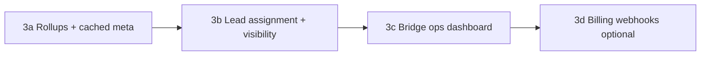

# SailsPipeline Multi-Tenant Design

**Last updated:** June 2026  
**Deployment:** Local Docker only (single default agency in daily use)

---

## Overview

SailsPipeline isolates CRM data by **agency** (`agency_id`, UUID). All authenticated API traffic is scoped to the agency encoded in the JWT. Cross-tenant access to records by ID returns **HTTP 404** (no existence leak).

| Phase | Status | Summary |
|-------|--------|---------|
| **0** | Complete | Root tables, JWT claims, ORM read filter, default agency backfill |
| **1** | Complete | Child-table `agency_id`, route-level ownership checks, tenant attachment paths, reports/analytics SQL scoping |
| **2** | Complete | Onboarding schema, roles, invitation ledgers, Team workspace, agent onboarding, subscription gatekeeper, user deactivation |
| **3** | In progress | Per-agency rollups (3a), lead assignment (3b), Bridge ops dashboard (3c); optional billing webhooks (3d) |

---

## Tenant model

| Concept | Implementation |
|---------|----------------|
| **Tenant** | `agencies` row (`CHAR(36)` UUID) |
| **Login handle** | `agencies.organization_handle` (unique slug, e.g. `bluehorizon`) |
| **Subscription** | `agencies.subscription_state`: Active, Trialing, Past Due, Locked |
| **Default agency** | `00000000-0000-4000-8000-000000000001` / handle `default` |
| **Root scoped tables** | `users`, `travel_requests`, `passengers` |
| **Child scoped tables (Phase 1)** | `proposed_cruises`, `request_notes`, `request_workflows`, `request_tasks`, `request_communications`, `call_transcripts`, `chat_logs`, `request_research_documents`, `quoted_insurance` |

---

## User roles (Phase 2)

| Role | Purpose |
|------|---------|
| `platform_super_admin` | Cross-tenant access to **The Bridge** (platform admin portal) |
| `tenant_super_user` | Agency owner; team management, invites, full agency visibility |
| `tenant_agent` | Sub-agent or independent contractor within one agency |

Permission columns on `users`:

- `is_active` — instant access revocation; inactive users cannot sign in but remain in the database for reporting
- `can_view_all_agency_leads` — contractor scoping; enforced in Phase 3 (see **3b**). When `false`, agent sees only assigned requests (plus requests they created, TBD at implementation)

Per-agency email uniqueness: `UNIQUE (agency_id, email)`.

---

## Invitation ledgers (Phase 2)

### `platform_invitations` — The Bridge

Platform super-admins provision new tenant companies. Columns include `target_agency_name`, `target_organization_handle`, `invite_email`, secure `token`, `is_used`, `expires_at`, and `cancelled_at`.

### `agency_invitations` — tenant team scaling

Tenant super users invite sub-agents from the CRM **Team** workspace. Scoped by `agency_id`, with `role` defaulting to `tenant_agent`. Invitations expire after 3 days and can be revoked before acceptance (`cancelled_at`).

---

## Auth and request context

1. **Login** accepts `organization_handle`, `username`, and `password`. The API resolves the agency by handle, then authenticates the user within that tenant. Inactive users are rejected at login.
2. **Login** issues JWT with `user_id`, `agency_id`, `role`, and `sub` (username).
3. **`TenantContextMiddleware`** decodes the JWT and sets tenant context before sync route handlers run.
4. **`get_current_user`** validates `user_id`, `agency_id`, `role`, and `is_active` against `users`.
5. **`/api/auth/me`** returns `role`, `is_active`, and `can_view_all_agency_leads`.

Unauthenticated routes (login, register, health) run without tenant context.

CRM and Bridge use separate browser tokens (`sailspipeline_crm_token` / `sailspipeline_bridge_token`) so both portals can stay open in different tabs.

---

## Subscription gatekeeper (Phase 2)

`SubscriptionGatekeeperMiddleware` returns **HTTP 402** when an agency's `subscription_state` is **Past Due** or **Locked**, blocking most CRM API routes.

| Still allowed when locked | Blocked when locked |
|---------------------------|---------------------|
| `/api/auth/me`, logout | Dashboard, requests, passengers, reports |
| Subscription restore page data | Team invites and other write paths |

The frontend redirects 402 responses to `/subscription-restore`.

---

## Defense in depth

| Layer | Behavior |
|-------|----------|
| **ORM session filter** | `with_loader_criteria` on all tenant-scoped models when `agency_id` context is set |
| **Route/service checks** | `agency_service` helpers → **404 Not found.** |
| **Attachment paths** | `{agency_id}/requests/{request_id}/{kind}/...` |
| **Reports / analytics** | Explicit `agency_id` filters on all aggregation queries |

---

## Phase 2 CRM Team workspace

Tenant super users open **Team** in the CRM sidebar.

| Capability | API / UI |
|------------|----------|
| List agency users and pending invites | `GET /api/agency/team` |
| Issue team invitation | `POST /api/agency/invites` → `/register-agent?token=…` |
| Revoke pending invitation | `DELETE /api/agency/invites/{id}` |
| Edit user email, role, active flag | `PATCH /api/agency/users/{user_id}` |
| Deactivate / reactivate user | Same PATCH (`is_active`); table actions + confirmation modal |
| Filter users by status | Team UI: Active only (default), Inactive only, or both |

Agent onboarding:

1. `GET /api/onboarding/agent/invites/verify?token=…`
2. `POST /api/onboarding/agent/accept` — creates `tenant_agent` (or invited role) under the issuing agency

Self-service rules: a super user cannot deactivate their own account or change their own role via PATCH.

---

## Schema and migrations

**Fresh installs** use `db/init.sql` (Phases 0–2 onboarding columns).

**Existing local Docker MySQL volume** (one-time, as needed):

```powershell
Get-Content db\migrate_multi_tenant_phase2.sql | docker compose exec -T db mysql -u<user> -p<pass> cruisetravelnow
Get-Content db\migrate_invitation_cancellation.sql | docker compose exec -T db mysql -u<user> -p<pass> cruisetravelnow
```

Prior phases: `migrate_multi_tenant_phase0.sql`, `migrate_multi_tenant_phase1.sql`.

**Automated tests** use disposable `test-db` from `init.sql`:

```powershell
docker compose --profile test rm -sf test-db
docker compose --profile test up -d test-db
docker compose --profile test run --rm backend-test
```

---

## Verification checklist

### Phase 0–1 (unchanged)

- [x] Login returns `user.agency_id` and `user.role` in `/api/auth/me`
- [x] Cross-tenant request and passenger IDs return 404
- [x] Reports and dashboard queries scoped by `agency_id`

### Phase 2 — roles and auth

- [x] CRM login requires `organization_handle` + username + password
- [x] Team sidebar link visible only to `tenant_super_user`
- [x] `GET /api/agency/team` returns 403 for `tenant_agent`
- [x] JWT and `/api/auth/me` reject inactive users
- [x] Inactive agency users cannot sign in (`is_active = false`)

### Phase 2 — agency team

- [x] Super user issues agency invite; token verifies at `/api/onboarding/agent/invites/verify`
- [x] Agent accepts invite at `/register-agent`; new user appears on team list
- [x] Super user revokes pending invite (`DELETE /api/agency/invites/{id}` → status Cancelled)
- [x] Invitations expire after 3 days
- [x] Super user PATCHes user role, email, and `is_active`
- [x] Self-deactivation and self-role change blocked
- [x] Team UI: deactivate/reactivate with confirmation; filter Active / Inactive / both (default Active)

### Phase 2 — subscription gatekeeper

- [x] Locked or Past Due agency receives HTTP 402 on protected CRM routes
- [x] `/api/auth/me` still works when subscription is Past Due or Locked
- [x] Frontend 402 handler navigates to subscription restore page

### Phase 2 — The Bridge

- [x] Bridge provisioning UI and onboarding APIs (`POST /api/bridge/invites`, `/register?token=…`)
- [x] Platform invitation revoke; tenant detail and subscription update from Bridge

---

## The Bridge

Platform operators with `platform_super_admin` open `/bridge` to issue tenant invitations and review the agency ledger.

1. `POST /api/bridge/invites` creates a `platform_invitations` row and returns `/onboarding?token=…`
2. Owners complete onboarding at `/onboarding`, which provisions `agencies` + `tenant_super_user` in one transaction

**Platform operator bootstrap:** run the one-time Bridge launch script after a fresh deploy (`docker compose --profile launch run --rm bridge-launch`). Credentials come from `SEED_BRIDGE_ADMIN_*` in `.env` — they are **not** applied on application startup.

---

## Phase 3 (planned)

Phase 3 shifts focus from **tenant safety** (Phases 0–2) to **tenant scale and operability**. Work is split into four slices, shipped in order. Slices **3a–3c** are the core milestone; **3d** is optional until paid hosting is a priority.



| Slice | Theme | Primary outcome |
|-------|-------|-----------------|
| **3a** | Performance rollups | Dashboard, Sales Analytics, and report meta stay fast as request volume grows |
| **3b** | Lead ownership | Contractors (`can_view_all_agency_leads = false`) see only their pipeline |
| **3c** | Bridge operational tooling | Platform operators monitor tenant health without ad hoc SQL |
| **3d** | Subscription automation | Billing provider webhooks drive `subscription_state` and self-service restore |

---

### 3a — Per-agency analytics rollups and cached meta

**Problem:** Dashboard counts, Sales Analytics, and `GET /api/reports/meta` aggregate live from transactional tables. Acceptable for a single agency today; degrades linearly as tenants and row counts grow.

**Approach:**

- Add **agency-scoped rollup tables** (or materialized summary rows) keyed by `agency_id`, refreshed on a schedule and/or on key domain events (request closed, cruise **accepted or deposited**, passenger updated).
- Cover at minimum:
  - Dashboard open / stale / closed counts, pipeline value, and booked volume/commission from **Accepted + Deposited proposed cruise rows** (each cruise row counts; back-to-back bookings on one request sum correctly)
  - Sales Analytics year/month metrics, funnel stage counts, brand share denominators (same cruise-row semantics)
  - Report meta caches: advisor names, residence states, workflow task group labels where currently queried per request
- Run a **background refresh job** (backend scheduled thread) with `last_refreshed_at` per agency.
- Expose rollup freshness in Bridge tenant detail (feeds **3c**).

**Booked-cruise aggregation (implemented):** Shared helper `booked_cruise_metrics.py` defines `BOOKED_CRUISE_STATUSES` (Accepted, Deposited). Rollups, Sales Analytics, supplier ledger, and sales manifest use SQL `COUNT` / `SUM(cost)` across all matching child rows per agency—not a single “lead” cruise per request. Open pipeline value sums all booked cruises on an open request; otherwise it uses the highest active quote on that request.

**Read path:** CRM routes read rollups first; fall back to live SQL when rollups are missing or stale (migration safety).

**Non-goals for 3a:** Cross-tenant analytics inside the CRM, event buses, or microservices.

---

### 3b — Lead assignment and contractor visibility

**Problem:** `users.can_view_all_agency_leads` exists (default `true`) but is not enforced. Multi-agent agencies cannot restrict contractors to their own book of business.

**Approach:**

- Add **`assigned_advisor_id`** (FK to `users.id`) on `travel_requests`.
- Default new requests to `created_by_id`; allow **tenant super users** to reassign from the request workspace or dashboard.
- Enforce list and detail queries:
  - `tenant_super_user` — full agency pipeline (unchanged).
  - `tenant_agent` with `can_view_all_agency_leads = true` — full agency pipeline.
  - `tenant_agent` with `can_view_all_agency_leads = false` — only rows where `assigned_advisor_id = current user` (and optionally `created_by_id = current user` for requests created before assignment existed).
- Team workspace: super user toggles **Can view all agency leads** when editing an agent (PATCH already supports user fields; wire UI + enforce in services).
- Reports and Sales Analytics: respect the same visibility rules (scoped aggregates, not full-agency numbers for restricted agents).

**Schema note:** Historical requests without assignment backfill to `created_by_id` as `assigned_advisor_id`.

---

### 3c — Bridge operational tooling

**Problem:** Phase 2 Bridge supports provisioning and manual subscription edits. Platform operators still lack a consolidated operational view.

**Approach (Bridge UI + APIs):**

| Capability | Purpose |
|------------|---------|
| **Platform overview** | Counts: active agencies, Past Due / Locked, pending platform invites, recent sign-ins |
| **Tenant health row** | Per agency: open request count, last activity, rollup freshness (**3a**), subscription state |
| **Agency suspend** | Use existing `agencies.is_active` (or equivalent) as a hard off-switch distinct from subscription lock |
| **Support exports** | Read-only CSV: agency users, open request count, invitation history (no CRM impersonation in 3c) |

**Deferred:** “Login as tenant user” impersonation — requires strict audit logging, time limits, and explicit operator consent; not part of initial 3c.

---

### 3d — Subscription restore and billing webhooks (optional)

**Problem:** Subscription gatekeeper and `/subscription-restore` exist, but restoration is manual via Bridge (`subscription_state` edit).

**Approach (when moving to paid multi-tenant hosting):**

- Integrate a billing provider (e.g. Stripe): checkout, customer portal, webhooks.
- Webhook handlers map payment events → `agencies.subscription_state` (Active, Past Due, Locked).
- Subscription restore page shows lock reason and **Manage billing** link.
- Bridge lists billing status per tenant (read-only mirror of provider state).

**Skip 3d** if deployment remains local/single-tenant with manual Bridge control.

---

### Phase 3 definition of done

Phase 3 is **complete** when:

1. A tenant with large request volume loads dashboard and report meta from rollups in acceptable time (target: sub-200ms p95 for rollup-backed reads under test load).
2. A contractor with `can_view_all_agency_leads = false` cannot list or open unassigned agency requests (404 / empty list, consistent with tenant isolation patterns).
3. Bridge operators see platform health and per-tenant rollup freshness without manual database queries.
4. Verification checklist below is green for **3a–3c** (3d checked only if billing is in scope).

---

### Phase 3 verification checklist

#### 3a — Rollups and cached meta

- [x] Rollup tables populated per `agency_id`; refresh job updates `last_refreshed_at`
- [x] `GET /api/dashboard` reads rollups (with safe fallback during rollout)
- [x] Sales Analytics and report meta use cached advisor/residence data where applicable
- [x] Rollup refresh is idempotent and safe to rerun after partial failure
- [x] Booked volume, commission, and booking counts aggregate all Accepted/Deposited cruise rows (back-to-back and side-by-side)
- [ ] Bridge tenant detail shows rollup freshness / last refresh time

#### 3b — Lead assignment and visibility

- [ ] `travel_requests.assigned_advisor_id` migrated; existing rows backfilled from `created_by_id`
- [ ] New requests default `assigned_advisor_id` to creator
- [ ] Super user can reassign advisor on a request
- [ ] Restricted agent open/closed lists exclude unassigned others' requests
- [ ] Restricted agent cross-ID access to others' requests returns 404
- [ ] Team UI toggles `can_view_all_agency_leads`; PATCH persists and enforcement applies on next request
- [ ] Reports / analytics respect agent visibility (no full-agency leak for restricted agents)

#### 3c — Bridge operational tooling

- [ ] Bridge overview: agency counts by subscription state and activity
- [ ] Per-tenant health metrics visible from Bridge ledger / detail
- [ ] Agency suspend/reactivate affects CRM access appropriately
- [ ] Support export downloads expected CSV shape (users, counts, invite summary)

#### 3d — Billing webhooks (optional)

- [ ] Webhook signature verification and idempotent event handling
- [ ] Payment failure → Past Due / Locked; successful payment → Active
- [ ] Subscription restore page links to billing portal when locked for payment
- [ ] Bridge displays billing status aligned with provider

---

### Phase 3 out of scope

- New CRM workflow templates or task types
- Cross-tenant reporting inside the CRM (Bridge remains the cross-tenant surface)
- Additional user roles beyond the three Phase 2 roles
- Distributed architecture (Kafka, separate analytics warehouse) — SQL rollups + cron are sufficient for this phase

---

### Phase 3 migrations (placeholder)

Migration filenames and exact DDL will be added when implementation starts. Expected artifacts:

- `db/migrate_multi_tenant_phase3_rollups.sql` — rollup tables and indexes (**3a implemented**)
- `db/migrate_proposed_cruise_reservation_ids.sql` — per-cruise `cabin_hold_reservation_ids` for multi-booking Enter Trip tasks
- `db/migrate_multi_tenant_phase3_lead_assignment.sql` — `assigned_advisor_id` on `travel_requests`
- Optional: `db/migrate_multi_tenant_phase3_billing.sql` — external customer/subscription IDs on `agencies`

